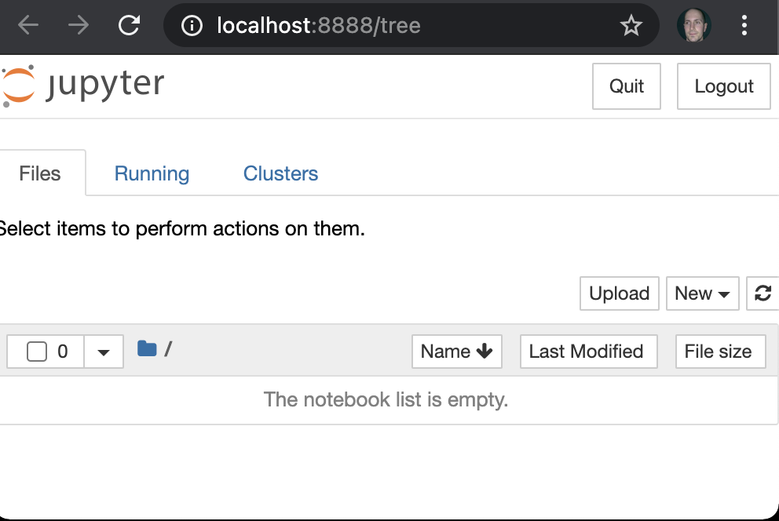
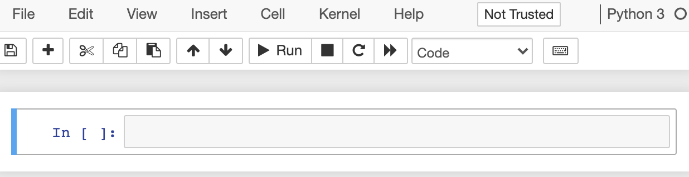
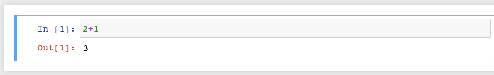
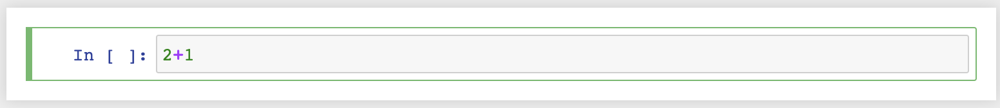
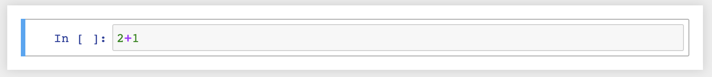

## Vad är Jupyter Notebook?
Jupyter Notebook kan beroende på kontext avse två saker:

- En webapplikation implementerad i Python för att redigare dokument innehållandes livekod, interaktiva widgets, ekvationer, visualiseringar och generell markdown.
- De dokument som redigeras av ovanstående webapplikation.

För tydlighets skull kommer vi här använda begreppet `Notebook Server` för webapplikationen, och `Notebook dokument` för filer med det aktuella filformatet.

## Installera Notebook Server?
TODO: Ska vi göra det här? Kommer vara problem med folks python-miljöer. Men personligen tycker jag det är trevligt att börja i den änden.

För att installera Notebook server, se till att ha Python 3 installerad och kör:

```sh
pip3 install notebook
```

TODO: Vänta in och hjälp folk här? Me

## Skapa ett första Notebook dokument
Skapa och gå till en tom katalog:

```sh
mkdir ~/first-jupyter
cd ~/first-jupyter
```

Starta Notebook Server med: ```jupyter notebook```. Borde resultera i output som:

> Jupyter Notebook 6.2.0 is running at:
> http://localhost:8888/?token=...

Om webläsaren inte öppnats automatiskt, gå till `http://localhost:8888`. Borde se ut som nedan:



Det här är filhanterar-delen av Jupyter, även kallad Jupyter Dashboard. Eftersom vi startat servern i en tom katalog listas inga filer.

För att skapa ett första Notebook dokument, välj `New`-knappen uppe till höger, och sedan `Python 3` alternativet i den meny som fälls ut. Du redigerar nu ett Notebook dokument. Och skärmen bör se ut som nedan:



Välj `File` > `Save as`, skriv in `firstnotebook` som filnamn och tryck `Save`.

Det resulterar i filen `firstnotebook.ipynb`, där `.ipynb` (från `IPython Notebook`) är file extensions för Jupyter Notebooks. Filformatet använder JSON, men det är mer av en implementationsdetalj än något de flesta använder sig av.

## Celler
Ett Notebook dokument består av celler, som kan vara av två typer:

- Celler innehållandes Markdown, som kan användas för formatterad text, bilder, videos och annat - i princip godtycklig HTML. 
- Celler inehållandes exekverbar python kod, där output (som kan vara exempelvis text, tabeller, bilder, grafer, ...) från koden hamnar precis under. Man kan se skillnad på markdown och kod-celler genom att de för kod innehåller labels (`In [...]` och `Out [...]` till vänster), och markdown inte gör det.

I det initiala dokument vi skapat finns initialt en tom kodcell. Fyll i python koden `2+1` i denna och tryck på `Play`-knappen (eller använd keyboard shortcut -  `Shift+Enter` på Windows+Linux, `Ctrl+Enter` på macOS) för att exekvera koden. Skärmen bör nu se ut som:

.

Notera följande:

- Medan koden körs markeras sektionen med `In [*]`.
- Output från koden syns sedan nedanför koden, i `Out`-sektionen.
- Det visas en exekveringsordning (`In/Out [1]` här, eftersom det var första koden som kördes). 
- Hade vi modifierat globalt scope, genom att t.ex. definiera top level variables eller importera beroenden, hade dessa varit gjorts tillgängliga för senare exekveringar.

En viktig aspekt är följande:

- Exekveringsordning spelar roll, och är inte nödvändigtvis i ordningen uppifrån och ner.
- Vid experiment hoppar man ofta runt.
- Bra praxis att avsluta att med kontroll att det går att köra i ordningen uppifrån och ner.

## Edit och Command mode
Editorn för en Notebook kan vara i två lägen:

- `Edit mode`, "textredigeringsläge", där text redigeras direkt.
- `Command mode`, där tangenter leder till kommandon.
 
 Likt vim editorn. Vilket läge som editorn är i markeras på två sätt:
 
 - Genom en ikon som ser ut som en penna.

- Genom att den markerade cellen är _grön_ vid edit, och _blå_ i command mode.



## Command palette
En trevlig funktionalitet för att lära sig editorn är Command palette - en dialog som listar alla kommandon, där fritext kan användas för att söka och sedan exekvera ett kommando. Lägg märke till att keyboard shortcuts visas i denna dialog, vilket gör det till bra verktyg för att lära sig keyboard shortcuts.

Aktivera detta genom att trycka på Keyboard-ikonen i Toolbar eller använda `Ctrl+Shift+P` / `Cmd+Shift+P`.

## Några keyboard shortcuts
I Command mode:

- Växla till Edit läge genom Enter (och sedan tillbaks till Command med Escape).
- `H` för att visa `Help`, lista över kommandon (stäng med `Escape`).
- Flytta fokus till nästa eller föregående cell med Up och Ner-piltangenterna (`J` och `K` fungerar också).
- `M` för att göra om kodcell till markdown, och `Y` för det omvända.
- `D+D` (`D` två gånger) för att ta bort cell.
- `Z` för att göra Undo efter att ha tagit bort cell av misstag.
- Håll inne `Shift` och använda piltangenter (eller J/K), eller mus, för att markera flera celler. `Shift+M` kan sen användas för att slå samman flera celler till en markdown-cell.

## Snabb intro till markdown?
Visa snabbt grundläggande markdown (heading, lista, kod, bild), för de som inte är bekväma med markdown, och visar också hur markdown kan redigeras i jupyter?

- Precis som `Shift+Enter` kör en kod-cell, så "kör" det en markdown cell genom att gå från redigeringsläge till renderat läge. Tryck `Enter` eller dubbelklicka i cellen för att redigera cellen igen.
  - Vid initial laddning av dokument kommer alla markdown-celler vara i renderat läge - dokumentet kommer inte komma ihåg vilka celler som är i Edit mode.
  
## Kernel
"Kärnan" i ett dokument innehåller state för dokumentet (deklarerade variabler och funktioner, importerade bibliotek). Gemensamt hela dokumentet, inte scope:at till celler.

Menyn `Kernel` har några användbare alternativ:

- `Interrupt` för att avbryta kod som körs.
  - Testa att lägga in `import time; time.sleep(1000)` och kör (`Shift+Enter`). Lägg märke till att den aktiva cellen markeras med `In [*]` medan den körs. Kärnan är nu upptagen, och andra kodceller som exekveras måste vänta. `Kernel > Interrupt` räddar den här situationen.
- `Restart` för att återställa kärnan till initialt läge (ta bort alla deklarerade variabler och funktioner osv).
  - Illustrera genom att ha en cell med y=10, och en andra med bara y.
  
