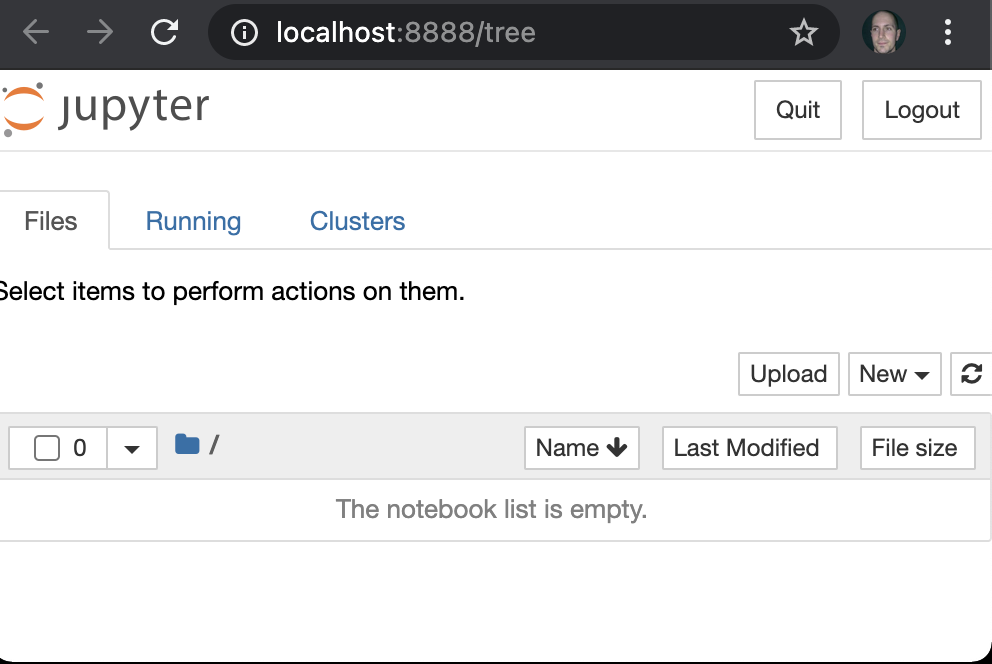
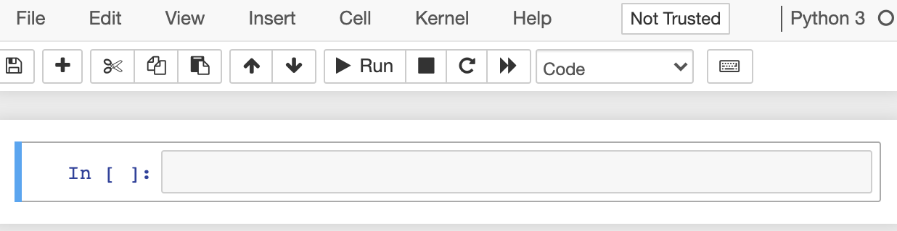

# vassare-jupyter
Vässardag om Jupyter notebooks

> Föreslå ett ämne eller tema.

Introduktion till Jupyter Notebook och hur python används med det verktyget.

> Fundera över syfte och mål. Vad vill du förmedla? Vad ska publiken få med sig?

- Ge en kunskap om vad Jupyter Notebook är.
- Ge en liten hands-on erfarenhet över att sätta upp en Jupyter Notebook och använda det.
- Ge introduktion till relaterade verktyg - NumPy, Pandas, något plot-verktyg, något om ML?
- Göra deltagarna intresserade av kommande studiecirkel.

> Önska hur lång tid du vill ha för din tapas.

Tror vi oss kunna fylla tre timmar? To be decided shortly perhaps. Med lite hands-on kan ju tiden dra iväg (och hellre säga för lång tid och avsluta i förtid än tvärtom).

## Förslag på punkter

- Vad är Jupyter Notebook
- Hands on: Installera och skapa ett första Notebook lokalt
- Hands on: Kom åt en hosted Notebook Server
- Genomgång av grundläggande editor funktionalitet
- Hands on: Skapa ett enkelt dokument
- Visa hur notebooks kan versionshanteras och inbyggd viewer i GitHub
- Lite mer advancerade funktioner
- Hands on: Något lite mer advancerat?
- Något om Numpy
- Något om Pandas
- Något om ML
- Blandade tips/best practice?
- Något om library för visualisering/grafer
- Hands on: Applicera något av ovanstående
- Något om Notebooks för fler språk än Python. Vad är en jupyter kernel?
- Vad är projekt Jupyter och vilka projekt rymmer den (JupyterLab, Jupyter Notebook, jupyterhub, Voilà)
- Presentera kommande studiecirkel.

## Vad är Jupyter Notebook?
Jupyter Notebook kan beroende på kontext avse två saker:

- En webapplikation implementerad i Python för att redigare dokument innehållandes livekod, interaktiva widgets, ekvationer, visualiseringar och generell markdown.
- De dokument som redigeras av ovanstående webapplikation.

För tydlighets skull kommer vi här använda begreppet `Notebook Server` för webapplikationen, och `Notebook dokument` för filer med det aktuella filformatet.

## Installera Notebook Server?
TODO: Ska vi göra det här? Kommer vara problem med folks python-miljöer. Men personligen tycker jag det är trevligt att börja i den änden.

För att installera Notebook server, se till att ha Python 3 installerad och kör:

```sh
pip3 install notebook
```

TODO: Vänta in och hjälp folk här? Me

## Skapa ett första Notebook dokument
Skapa och gå till en tom katalog:

```sh
mkdir ~/first-jupyter
cd ~/first-jupyter
```

Starta Notebook Server med: ```jupyter notebook```. Borde resultera i output som:

> Jupyter Notebook 6.2.0 is running at:
> http://localhost:8888/?token=...

Om webläsaren inte öppnats automatiskt, gå till `http://localhost:8888`. Borde se ut som nedan:



För att skapa ett första Notebook dokument, välj `New`-knappen uppe till höger, och sedan `Python 3` alternativet i den meny som fälls ut. Du redigerar nu ett Notebook dokument. Och skärmen bör se ut som nedan:



Välj `File` > `Save as`, skriv in `firstnotebook` som filnamn och tryck `Save`.

Det resulterar i filen `firstnotebook.ipynb`, där `.ipynb` (från `IPython Notebook`) är file extensions för Jupyter Notebooks. Filformatet använder JSON, men det är mer av en implementationsdetalj än något de flesta använder sig av.

## Celler
Ett Notebook dokument består av celler, som kan vara av två typer:

- Celler innehållandes Markdown, som kan användas för formatterad text, bilder, videos och annat - i princip godtycklig HTML.
- Celler inehållandes exekverbar python kod, där output (som kan vara exempelvis text, tabeller, bilder, grafer, ...) från koden hamnar precis under. 

I det initiala dokument vi skapat finns initialt en tom kodcell. Fyll i python koden `2+1` i denna och tryck på `Play`-knappen (eller använd keyboard shortcut -  `Shift+Enter` på Windows+Linux, `Ctrl+Enter` på macOS) för att exekvera koden. Skärmen bör nu se ut som:

.

Notera följande:

- Output från koden syns nedanför koden, i `Out`-sektionen.
- Det visas en exekveringsordning (`[1]` här). När 
- Hade vi modifierat globalt scope, genom att t.ex. definiera top level variables eller importera beroenden, hade dessa varit gjorts tillgängliga för senare exekveringar.

En viktig aspekt är följande:

- Exekveringsordning spelar roll, och är inte nödvändigtvis i ordningen uppifrån och ner.
- Vid experiment hoppar man ofta runt.
- Bra praxis att avsluta att med kontroll att det går att köra i ordningen uppifrån och ner.

## Redigera ett Notebook dokument
Editorn för en Notebook kan vara i två lägen:

- `Edit mode`, "textredigeringsläge", där text redigeras direkt.
- `Command mode`, där tangenter leder till kommandon.
  - `H` för att visa `Help`, lista över kommandon (stäng med `Escape`).
  - `C` för att kopiera markerad cell.
  - `V` för att klistra in kopierad cell.
  - `D,D` (tangenten `D` två gånger) för att radera markerad cell.
  - ..
 
 Likt vim editorn.
